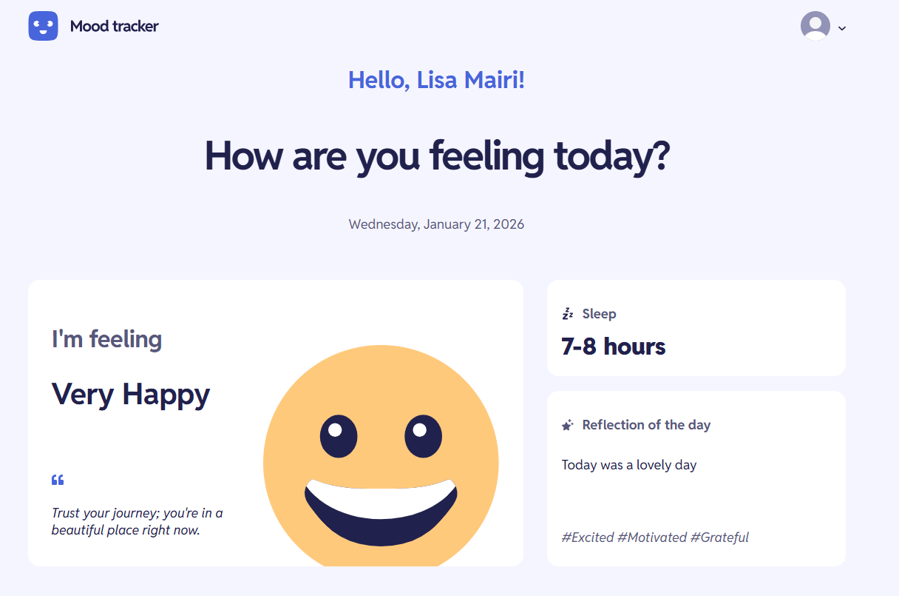
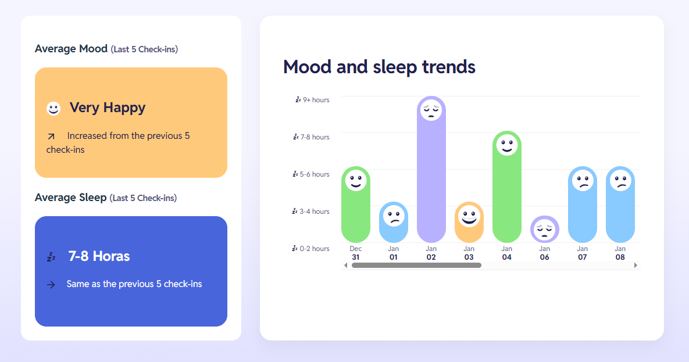
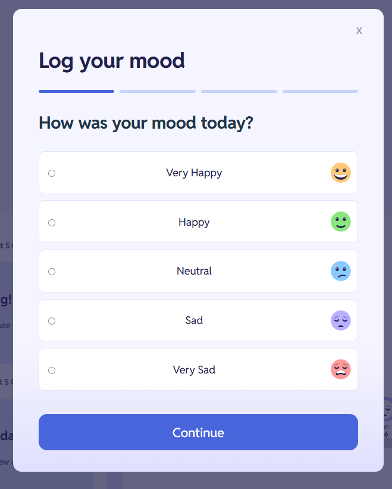

# 😊 Mood Tracking App - [Frontend Mentor](https://www.frontendmentor.io/challenges/mood-tracking-app-E2XeKhDF0B)

Mood Tracking App es un proyecto de FrontendMentor para rastrear tu estado de ánimo diario, horas de sueño, reflexiones personales, y llevar una correlación de manera visual e intuitiva. Construida con React 19 y Vite.


## 📋 Tabla de Contenidos

- [Descripción](#-descripción)
- [Capturas de Pantalla](#-capturas-de-pantalla)
- [Características](#-características)
- [Tecnologías](#-tecnologías)
- [Instalación](#-instalación)
- [Uso](#-uso)
- [Estructura del Proyecto](#-estructura-del-proyecto)
- [Contribuciones](#-contribuciones)
- [Licencia](#-licencia)

## 🎯 Descripción

Mood Tracking App es una aplicación de seguimiento personal que te permite registrar y analizar tu bienestar emocional diario. La aplicación te ayuda a:

- **Registrar tu estado de ánimo** diario con un sistema intuitivo
- **Rastrear tus horas de sueño** para identificar patrones
- **Escribir reflexiones** sobre tu día
- **Visualizar tendencias** de tu estado de ánimo y sueño
- **Ver promedios** de tus últimos registros y ver si hay mejoría o no

## 🎨 Capturas de Pantalla

### Vista Principal



### Formulario de Registro



## ✨ Características

### 📝 Registro Diario
- Sistema de formulario multi-paso intuitivo
- 5 estados de ánimo: Very Happy, Happy, Neutral, Sad, Very Sad
- Selección de hasta 3 tags de sentimientos (Joyful, Calm, Anxious, etc.)
- Campo de texto para reflexiones del día (máximo 150 caracteres)
- Registro de horas de sueño (0-2, 3-4, 5-6, 7-8, 9+ horas)

### 📊 Análisis y Visualización
- **Promedio de Estado de Ánimo**: Calcula el estado de ánimo más frecuente de los últimos 5 registros, e indica si mejoró, empeoró o sigue igual al de el ultimo promedio anterior (5 días antes).
- **Promedio de Sueño**: Muestra el promedio de horas de sueño, y realiza la misma comparación que el estado de ánimo pero con las horas de sueño.
- **Gráfico de Tendencias**: Visualización combinada de estado de ánimo y horas de sueño para ver fácilmente tendencias de forma visual.

### 💾 Persistencia de Datos
- Almacenamiento local en el navegador (localStorage)
- Los datos persisten entre sesiones

### 🎨 Diseño
- Interfaz moderna y limpia
- Diseño responsive (adaptable a móviles y tablets)
- Variables CSS para fácil personalización
- Iconografía consistente

## 🛠️ Tecnologías

- **React 19.1.1** 
- **Vite 7.1.7** 
- **JavaScript (ES6+)**
- **CSS3** 

## 📦 Instalación

### Prerrequisitos

Asegúrate de tener instalado:
- **Node.js** (versión 18 o superior)
- **npm** o **yarn** o **pnpm**

### Pasos de Instalación

1. **Clona el repositorio** (o descarga el código)
   ```bash
   git clone https://github.com/JesusAlarconDev/Mood-Tracking-App-React-FrontendMentor
   cd Mood-Tracking-App
   ```

2. **Instala las dependencias**
   ```bash
   npm install
   ```
   o
   ```bash
   yarn install
   ```
   o
   ```bash
   pnpm install
   ```

3. **Inicia el servidor de desarrollo**
   ```bash
   npm run dev
   ```

4. **Abre tu navegador** y visita `http://localhost:5173`

## 🚀 Uso

### Registro de Estado de Ánimo

1. Al abrir la aplicación, verás un saludo personalizado y la fecha actual
2. Haz clic en el botón **"Log today's mood"**
3. Sigue el formulario paso a paso:
   - **Paso 1**: Selecciona tu estado de ánimo del día
   - **Paso 2**: Elige hasta 3 tags que describan cómo te sentiste
   - **Paso 3**: Escribe una breve reflexión sobre tu día (máximo 150 caracteres)
   - **Paso 4**: Selecciona cuántas horas dormiste anoche
4. Haz clic en **"Submit"** para guardar tu registro

### Visualización de Datos

- **Promedio de Estado de Ánimo**: Se muestra después de tener al menos 10 registros
- **Promedio de Sueño**: Calculado automáticamente
- **Gráfico de Tendencias**: Visualiza todos tus registros en un gráfico combinado

### Ver Registro del Día

Si ya registraste tu estado de ánimo hoy, verás un resumen con:
- Tu estado de ánimo actual
- Una cita inspiradora relacionada con tu estado
- Horas de sueño
- Tu reflexión del día
- Los tags de sentimientos seleccionados

## 📁 Estructura del Proyecto

```
Mood-Tracking-App/
├── public/                 # Archivos estáticos
│   └── vite.svg
├── src/
│   ├── assets/            # Recursos (imágenes, iconos)
│   │   └── images/
│   ├── components/        # Componentes React
│   │   ├── AveragesComponent/    # Componente de promedios
│   │   ├── MoodForm/            # Formulario de registro
│   │   ├── MoodImage/           # Imágenes de estados de ánimo
│   │   ├── MoodImageWhite/       # Imágenes blancas de estados
│   │   ├── MoodSleepTrends/     # Gráfico de tendencias
│   │   ├── TodaysMood/          # Resumen del día actual
│   │   ├── TrendImage/           # Iconos de tendencias
│   │   └── Home.jsx              # Componente principal
│   ├── constants/         # Constantes y datos mock
│   │   └── mockData.js
│   ├── hooks/             # Hooks personalizados
│   │   └── useAverage.js
│   ├── utils/             # Funciones utilitarias
│   │   ├── getMoodColor.js
│   │   ├── getMoodQuote.js
│   │   └── getSleepHeight.js
│   ├── App.jsx            # Componente raíz
│   ├── App.css            # Estilos globales
│   ├── main.jsx           # Punto de entrada
│   └── index.css          # Estilos base
├── .gitignore
├── eslint.config.js       # Configuración de ESLint
├── index.html
├── package.json
├── vite.config.js         # Configuración de Vite
└── README.md
```

## 🤝 Contribuciones

Las contribuciones son bienvenidas. Para cambios importantes:

1. Fork el proyecto
2. Crea una rama para tu feature (`git checkout -b feature/AmazingFeature`)
3. Commit tus cambios (`git commit -m 'Add some AmazingFeature'`)
4. Push a la rama (`git push origin feature/AmazingFeature`)
5. Abre un Pull Request

## 📄 Licencia

Este proyecto está bajo la Licencia MIT. Ver el archivo `LICENSE` para más detalles.

## 👤 Autor

Jesús Manuel Alarcón
- GitHub: [@JesusAlarconDev](https://github.com/JesusAlarconDev)
- Mi sitio web: [www.jesusmanuelalarcon.com](www.jesusmanuelalarcon.com)

---

⭐ Si te gustó este proyecto, ¡dale una estrella!

---

**Hecho con ❤️ usando React y Vite**
